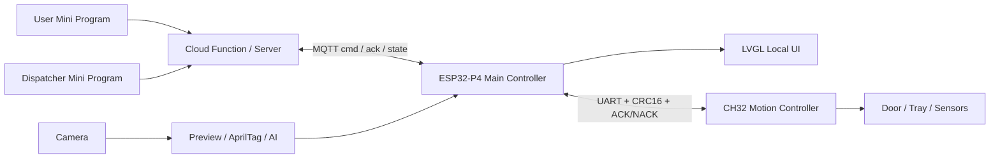

<p align="center">
  
</p>

<h1 align="center">SkyAnchor Embedded Competition</h1>

<p align="center">
  <b>An intelligent micro-port node for low-altitude urban logistics demos</b><br>
  ESP32-P4 + CH32 + Camera + LVGL + AprilTag + Drone AI + MQTT + WeChat Mini Program
</p>

<p align="center">
  <a href="README.zh-CN.md">简体中文</a> | English
</p>

<p align="center">
  
  
  
  
  
  
  
</p>

SkyAnchor is a multi-end unmanned delivery receiving-cabin demo. The ESP32-P4 board handles vision, UI, task orchestration, MQTT communication, voice prompts, and the main control state machine. The CH32 controller drives the door, tray, sensors, and safety actions. A WeChat Mini Program and cloud function provide ordering, dispatching, and order-status visualization for live demos.

## Highlights

- ESP32-P4 main controller with camera preview, AprilTag localization, drone AI classification, LVGL UI, MQTT state reporting, and voice prompts.
- CH32 motion controller for cabin door, tray extension/retraction, cargo detection, limit switches, and safety locking.
- Camera pipeline based on V4L2 USERPTR, PPA/CPU scaling, LVGL preview, and separated AI/AprilTag frame routing.
- Safety takeover mode with weather/emergency recovery, drone departure detection, drone return detection, and localized audio prompts.
- End-to-end demo workflow across user Mini Program, dispatcher Mini Program, cloud function, MQTT broker, board firmware, and optional FastAPI backend.

## Architecture



## Demo Flow

```text
User submits an order
  -> Dispatcher assigns an AprilTag target
  -> Cloud function or server publishes MQTT start_task
  -> ESP32-P4 starts vision and identifies drone / tag
  -> CH32 executes receiving-cabin actions
  -> Device reports ack / state / failure reason
  -> Mini Program updates the order timeline
```

## Repository Layout

```text
main/                  ESP32-P4 app entry, boot flow, and main services
components/            BSP, camera, vision, UI, control, AI, audio, and shared types
CH32/                  CH32 motion-controller firmware and MounRiver project
skyanchor-miniapp/     WeChat Mini Program, cloud function, and demo pages
skyanchor-server/      Optional FastAPI backend for local debugging
tools/                 Optional AI training, model conversion, and maintenance scripts
```

Local development may keep `build/`, `managed_components/`, and `ai_models/` in the workspace for fast rebuilds, dependency caching, and model flashing. These directories are normally not committed to GitHub.

## Core Modules

| Module | Responsibility |
| --- | --- |
| `main/` | Initializes NVS, display, UI, CH32 serial link, MQTT, vision, and background services. |
| `components/camera` | Captures frames, scales preview output, routes frames, and records display statistics. |
| `components/vision_ui` | Provides the LVGL main screen, safety takeover UI, AprilTag logic, and UI assets. |
| `components/drone_ai` | Loads the drone classifier, schedules inference, and supports continuous monitoring. |
| `components/control` | Owns task state machines, MQTT commands, CH32 protocol, and safety takeover flow. |
| `components/audio_prompt` | Plays embedded PCM voice prompts through I2S/ES8311. |
| `CH32/` | Controls actuators, reads limit/cargo states, and responds to the ESP32-P4 protocol. |

## Build ESP32-P4 Firmware

Recommended environment: ESP-IDF v5.5.x with target `esp32p4`.

```powershell
idf.py set-target esp32p4
idf.py build
idf.py flash monitor
```

This project depends on ESP32-P4 Function EV Board BSP, ESP-DL, LVGL, MQTT, and related ESP-IDF components. `managed_components/` is a local component-manager cache and is intentionally ignored by Git.

### AI Model File

The drone AI model is treated as a local artifact. To enable AI inference and model-partition flashing, place the model at:

```text
ai_models/drone_cls_pretrained_v3/drone_cls_p4_int8.espdl
```

If the file is missing, CMake skips the model flashing target with a warning. Firmware configuration can still proceed, but runtime drone AI requires the model to be flashed to the `model` partition defined in `partitions.csv`.

## Build CH32 Firmware

Open the `CH32/` project with MounRiver Studio, then configure the downloader, serial port, and target board for the actual hardware. The ESP32-P4 and CH32 coordinate through a UART protocol; CH32 status maps back into the main task state and UI.

## Mini Program And Server

- `skyanchor-miniapp/`: WeChat Mini Program and cloud function for the live demo.
- `skyanchor-server/`: Optional FastAPI backend for local validation without relying on the WeChat cloud function.

Device names, MQTT topics, demo users, and dispatch details are documented in each subproject README.

## What The Demo Shows

This repository presents a complete low-altitude logistics receiving node rather than a single-board prototype. It connects mobile ordering, dispatcher assignment, cloud-to-device messaging, on-device vision, actuator control, local UI feedback, and voice prompts into one demonstrable workflow.

## Repository Contents

- ESP32-P4 firmware source for the main controller, including camera, UI, MQTT, AI, audio, and task-control modules.
- CH32 firmware source for the motion controller that drives the receiving-cabin mechanisms.
- WeChat Mini Program and optional FastAPI backend code for reviewing or reproducing the order workflow.
- AI model artifacts and build caches are kept as local development resources. The expected model path is documented so the full AI-enabled firmware can be reproduced.
- Credentials, private cloud configuration, logs, databases, and generated build outputs are intentionally excluded from the public source tree.
