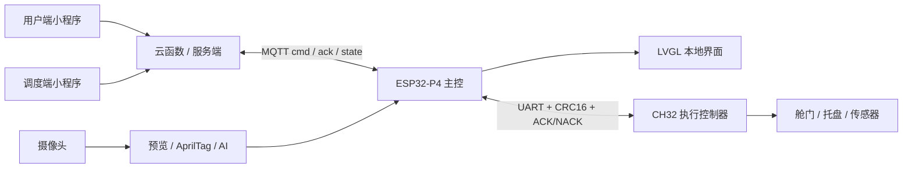

<p align="center">
  
</p>

<h1 align="center">SkyAnchor Embedded Competition</h1>

<p align="center">
  <b>面向城市低空物流演示的智能微港节点</b><br>
  ESP32-P4 + CH32 + Camera + LVGL + AprilTag + Drone AI + MQTT + WeChat Mini Program
</p>

<p align="center">
  
  
  
  
  
  
  
</p>

SkyAnchor 是一个多端协同的无人配送接收舱演示工程。ESP32-P4 负责视觉、UI、任务调度、MQTT 通信与主控状态机；CH32 负责舱门、托盘和传感器等执行机构；微信小程序与云函数负责下单、调度、订单状态展示和现场演示闭环。

## 项目亮点

- ESP32-P4 主控：摄像头预览、AprilTag 定位、无人机 AI 分类、LVGL 交互界面和 MQTT 设备状态上报。
- CH32 从控：通过 UART 二进制协议执行开门、托盘伸缩、货物检测和安全锁定动作。
- 视觉链路：V4L2 USERPTR 取帧，PPA/CPU 缩放，显示缓冲与 AI/AprilTag 路由分离。
- 安全接管：支持恶劣天气/异常场景的安全回收流程，并带离场检测、目标返回和语音播报。
- 多端演示：微信小程序用户端、调度端、云函数和可选 FastAPI 本地服务形成订单闭环。

## 系统架构



## 演示闭环

```text
用户提交订单
  -> 调度端分配 AprilTag 目标
  -> 云函数或服务端下发 MQTT start_task
  -> ESP32-P4 打开视觉链路并识别无人机 / Tag
  -> CH32 执行接收舱动作
  -> 设备持续上报 ack / state / failure reason
  -> 小程序刷新订单时间线
```

## 仓库结构

```text
main/                  ESP32-P4 应用入口、启动流程和主服务
components/            BSP、相机、视觉、UI、控制、AI、语音和共享类型
CH32/                  CH32 执行控制器固件与 MounRiver 工程
skyanchor-miniapp/     微信小程序、云函数和演示端页面
skyanchor-server/      FastAPI 本地调试后端，可选
tools/                 AI 训练、模型转换和维护脚本，可选
```

本地构建时会生成或保留 `build/`、`managed_components/`、`ai_models/` 等目录；这些内容通常不提交到 GitHub，但在开发机上可以保留以便快速编译和烧录。

## 核心模块

| 模块 | 职责 |
| --- | --- |
| `main/` | 初始化 NVS、屏幕、UI、CH32 串口、MQTT、视觉和后台服务 |
| `components/camera` | 摄像头取帧、预览缩放、帧路由和显示统计 |
| `components/vision_ui` | LVGL 主屏、安全接管页、AprilTag 和 UI 资源 |
| `components/drone_ai` | 无人机二分类模型加载、推理调度和连续监测 |
| `components/control` | 任务状态机、MQTT 命令、CH32 协议、安全接管流程 |
| `components/audio_prompt` | I2S/ES8311 语音播报与提示音资源 |
| `CH32/` | 执行机构控制、限位/货物状态、从控协议响应 |

## 构建 ESP32-P4

建议使用 ESP-IDF v5.5.x，目标芯片为 `esp32p4`。

```powershell
idf.py set-target esp32p4
idf.py build
idf.py flash monitor
```

本工程依赖 ESP32-P4 Function EV Board 相关 BSP、ESP-DL、LVGL、MQTT 等组件。`managed_components/` 是本地组件缓存，清理仓库时可以不提交，但本机保留有助于快速编译。

### AI 模型文件

无人机 AI 模型没有放入仓库。需要启用 AI 推理时，将模型放到：

```text
ai_models/drone_cls_pretrained_v3/drone_cls_p4_int8.espdl
```

如果该文件不存在，CMake 会跳过模型分区刷写目标；固件仍可构建，但运行时无人机 AI 无法正常加载模型。模型分区在 `partitions.csv` 中定义为 `model`。

## 构建 CH32

使用 MounRiver Studio 打开 `CH32/` 工程，按现场硬件配置下载器、串口和目标板。ESP32-P4 与 CH32 通过 UART 协议协同，协议状态会映射到主控任务状态和 UI。

## 小程序与服务

- `skyanchor-miniapp/`：微信小程序与云函数，适合现场演示。
- `skyanchor-server/`：FastAPI 本地调试服务，用于不依赖微信云函数时验证订单和 MQTT 闭环。

小程序侧的设备名、MQTT topic、演示用户和调度流程见各子目录 README。

## 现场检查

启动演示前建议确认：

- ESP32-P4 串口出现 `wifi got ip`。
- MQTT 连接成功并能收到云端命令。
- CH32 串口链路在线，状态页无从控异常。
- 摄像头首帧能进入 LVGL 预览。
- AprilTag 目标与调度端分配一致。
- 语音播报开关符合现场要求。

## 仓库维护说明

- `build/`、`managed_components/` 是本地构建缓存，已在 `.gitignore` 中忽略。
- `ai_models/`、虚拟环境、数据库、日志和临时输出不进入仓库。
- 硬件密钥、MQTT 凭据、微信云配置和本地 `.env` 文件不要提交。
- 本仓库用于竞赛、学习和作品展示；第三方组件、云服务和硬件资料遵循其原始许可。
