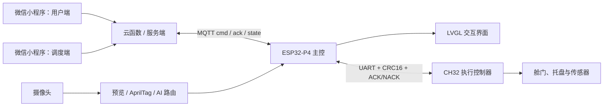

# SkyAnchor Embedded Competition

面向无人配送演示场景的多端协同系统。项目将 ESP32-P4 主控、CH32 执行控制器、摄像头与 LVGL 界面、AprilTag 视觉定位、MQTT 设备通信、微信小程序和服务端流程整合在同一仓库中。

> A multi-device delivery demo integrating ESP32-P4 firmware, a CH32 controller, camera and LVGL UI, AprilTag localization, MQTT messaging, a WeChat Mini Program, and backend services.


> 演示素材待补：建议添加整机照片，以及“用户下单 → 调度 → 板端执行 → 状态回传”的短视频。

## 演示流程

```text
用户端下单
  -> 调度台分配 AprilTag 目标
  -> MQTT 下发 start_task
  -> ESP32-P4 进入识别与执行流程
  -> CH32 执行机构完成舱门/托盘动作
  -> 设备持续上报 ACK、状态与失败原因
  -> 小程序展示订单时间线
```

## 系统架构



## 核心模块

| 子系统 | 职责 |
| --- | --- |
| ESP32-P4 应用 | 系统启动、任务控制、设备状态和主业务流程 |
| 摄像头链路 | V4L2 USERPTR 取帧、PPA/CPU 缩放、LVGL 预览和视觉任务分流 |
| 视觉与 UI | AprilTag 识别、LVGL 页面、状态展示和交互 |
| 控制协议 | ESP32 与 CH32 之间的二进制帧、CRC16、ACK/NACK 和状态缓存 |
| CH32 固件 | 执行机构控制、传感器检查和安全状态机 |
| 小程序与服务 | 下单、调度、自检、订单状态轮询及 MQTT 消息转发 |

## 关键工程问题

### 摄像头预览的数据所有权

摄像头回调、图像缩放和 LVGL 显示运行在不同执行上下文。工程使用独立的 UI canvas 缓冲区和 stage buffer 状态队列，避免相机复用缓冲区时覆盖正在显示的画面，并处理 cache 同步和 RGB565 帧检查。

### 多控制器可靠通信

ESP32-P4 与 CH32 使用 UART 二进制协议。协议层包含帧头、负载长度、序号、CRC16/IBM、ACK/NACK、错误码与超时处理；上层通过状态快照判断从控是否可用。

### 设备与订单状态一致性

MQTT topic 按 `cmd`、`ack`、`state` 分离。设备使用 retained state 对外提供当前状态，小程序和服务端据此推进订单时间线，并保留天气保护、失败原因和取消流程。

## 仓库结构

```text
main/                  ESP32-P4 应用入口与项目配置
components/            摄像头、控制、UI、AI、BSP 和共享类型
CH32/                  CH32 控制器固件与 MounRiver 工程
skyanchor-miniapp/     微信小程序与云函数
skyanchor-server/      FastAPI 本地调试后端
tools/                 转换和维护脚本
DEMO_RUNBOOK.md        演示流程与故障检查清单
```

## 构建与演示

### ESP32-P4

项目提供 `sdkconfig.defaults` 和 `sdkconfig.defaults.esp32p4`。在已安装对应 ESP-IDF 与板级组件的环境中：

```bash
idf.py set-target esp32p4
idf.py build
idf.py flash monitor
```

### CH32

使用 MounRiver Studio 打开 `CH32/` 下的工程，按实际开发板配置下载器和串口。

### 小程序

使用微信开发者工具导入 `skyanchor-miniapp/`，部署所需云函数，并按 `DEMO_RUNBOOK.md` 完成自检和演示。

完整演示步骤及预期日志见 [DEMO_RUNBOOK.md](DEMO_RUNBOOK.md)。

## 我的工作

当前仓库提交记录显示我持续参与并维护以下部分：

- ESP32-P4 摄像头预览、显示缓冲与 LVGL 界面
- AprilTag/AI 图像路由及任务状态衔接
- ESP32 与 CH32 通信协议、状态缓存和异常处理
- 小程序界面、设备状态流和演示稳定性优化
- 工程目录、注释、忽略规则和演示文档整理

本项目包含竞赛团队协作内容；个人负责边界应以提交记录、现场分工和最终简历描述为准，不将团队成果全部表述为个人独立完成。

## 当前限制

- 构建依赖具体 ESP32-P4 开发板、摄像头、显示组件和 CH32 硬件
- 云端密钥、MQTT 凭据、模型文件和本地运行数据不进入仓库
- 实物照片、完整演示视频、队伍分工和硬件接线文档仍需补充
- 本地 FastAPI 服务用于调试；正式演示流程以微信云开发方案为准

## 使用说明

本仓库用于竞赛、学习和作品展示。涉及的第三方组件、模型、云服务和硬件资料分别遵循其原始许可与使用条款。
