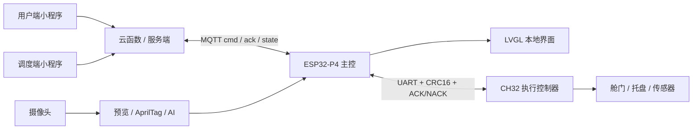

<p align="center">
  
</p>

<h1 align="center">SkyAnchor Embedded Competition</h1>

<p align="center">
  <b>面向城市低空物流演示的智能微港节点</b><br>
  ESP32-P4 + CH32 + Camera + LVGL + AprilTag + Drone AI + MQTT + WeChat Mini Program
</p>

<p align="center">
  简体中文 | <a href="README.md">English</a>
</p>

<p align="center">
  
  
  
  
  
  
  
</p>

SkyAnchor 是一个多端协同的无人配送接收舱演示工程。ESP32-P4 负责视觉、UI、任务调度、MQTT 通信、语音播报与主控状态机；CH32 负责舱门、托盘、传感器和安全执行；微信小程序与云函数负责下单、调度、订单状态展示和现场演示闭环。

## 项目亮点

- ESP32-P4 主控：摄像头预览、AprilTag 定位、无人机 AI 分类、LVGL 交互界面、MQTT 状态上报和语音提示。
- CH32 从控：执行舱门、托盘伸缩、货物检测、限位检测和安全锁定。
- 视觉链路：基于 V4L2 USERPTR 取帧，结合 PPA/CPU 缩放、LVGL 预览和 AI/AprilTag 分流。
- 安全接管：支持异常/天气保护下的安全回收，并包含离场检测、目标返回检测和语音播报。
- 多端闭环：用户端小程序、调度端小程序、云函数、MQTT、板端固件和可选 FastAPI 服务共同完成演示流程。

## 系统架构



## 演示闭环

```text
用户提交订单
  -> 调度端分配 AprilTag 目标
  -> 云函数或服务端下发 MQTT start_task
  -> ESP32-P4 打开视觉链路并识别无人机 / Tag
  -> CH32 执行接收舱动作
  -> 设备持续上报 ack / state / failure reason
  -> 小程序刷新订单时间线
```

## 仓库结构

```text
main/                  ESP32-P4 应用入口、启动流程和主服务
components/            BSP、相机、视觉、UI、控制、AI、语音和共享类型
CH32/                  CH32 执行控制器固件与 MounRiver 工程
skyanchor-miniapp/     微信小程序、云函数和演示端页面
skyanchor-server/      FastAPI 本地调试后端，可选
tools/                 AI 训练、模型转换和维护脚本，可选
```

本地开发机可以保留 `build/`、`managed_components/`、`ai_models/` 等目录，用于快速编译、依赖缓存和模型刷写；这些内容通常不提交到 GitHub。

## 核心模块

| 模块 | 职责 |
| --- | --- |
| `main/` | 初始化 NVS、屏幕、UI、CH32 串口、MQTT、视觉和后台服务。 |
| `components/camera` | 摄像头取帧、预览缩放、帧路由和显示统计。 |
| `components/vision_ui` | LVGL 主屏、安全接管页、AprilTag 逻辑和 UI 资源。 |
| `components/drone_ai` | 加载无人机分类模型，调度推理任务，并支持连续监测。 |
| `components/control` | 任务状态机、MQTT 命令、CH32 协议和安全接管流程。 |
| `components/audio_prompt` | 通过 I2S/ES8311 播放内嵌 PCM 语音提示。 |
| `CH32/` | 控制执行机构、读取限位/货物状态，并响应 ESP32-P4 协议。 |

## 构建 ESP32-P4 固件

建议环境：ESP-IDF v5.5.x，目标芯片 `esp32p4`。

```powershell
idf.py set-target esp32p4
idf.py build
idf.py flash monitor
```

本工程依赖 ESP32-P4 Function EV Board BSP、ESP-DL、LVGL、MQTT 等 ESP-IDF 组件。`managed_components/` 是本地组件管理器缓存，已由 `.gitignore` 忽略。

### AI 模型文件

无人机 AI 模型作为本地构建/刷写资源管理。需要启用 AI 推理和模型分区刷写时，将模型放到：

```text
ai_models/drone_cls_pretrained_v3/drone_cls_p4_int8.espdl
```

如果模型文件不存在，CMake 会给出提示并跳过模型刷写目标；固件配置仍可继续，但运行时无人机 AI 需要该模型写入 `partitions.csv` 中定义的 `model` 分区。

## 构建 CH32 固件

使用 MounRiver Studio 打开 `CH32/` 工程，根据实际硬件配置下载器、串口和目标板。ESP32-P4 与 CH32 通过 UART 协议协同，CH32 状态会同步到主控任务状态和 UI。

## 小程序与服务

- `skyanchor-miniapp/`：微信小程序与云函数，用于现场演示。
- `skyanchor-server/`：可选 FastAPI 本地调试服务，用于不依赖微信云函数时验证订单和 MQTT 闭环。

设备名、MQTT topic、演示用户和调度细节见各子项目 README。

## 展示内容

本仓库展示的是一个完整的低空物流接收节点，而不是单板功能验证。项目把手机下单、调度分配、云端到设备通信、板端视觉、机构执行、本地 UI 反馈和语音提示串成了一条可演示的闭环流程。

## 仓库内容

- ESP32-P4 主控固件源码，包含相机、UI、MQTT、AI、语音和任务控制模块。
- CH32 从控固件源码，用于驱动接收舱舱门、托盘和传感器等执行机构。
- 微信小程序和可选 FastAPI 后端代码，用于查看或复现订单流程。
- AI 模型产物和构建缓存作为本地开发资源保留；README 中说明了完整 AI 固件复现所需的模型路径。
- 凭据、私有云配置、日志、数据库和生成式构建输出不会放入公开源码树。
